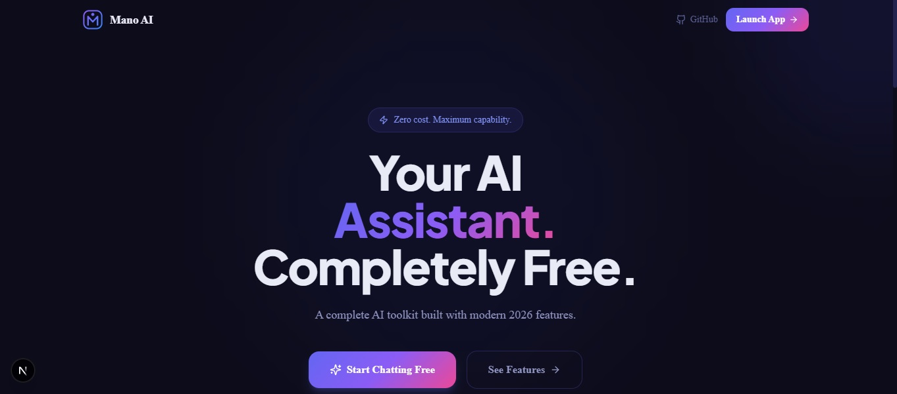
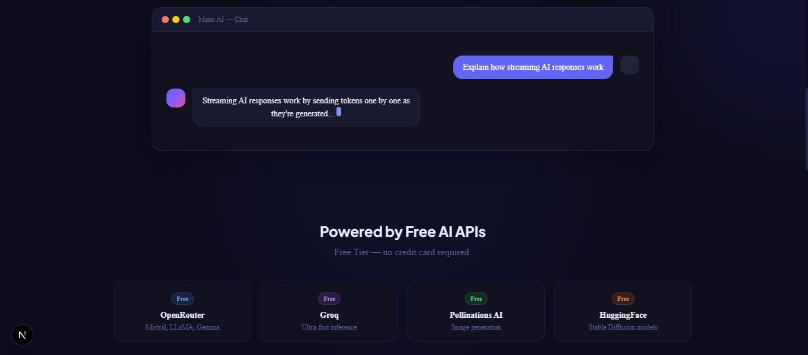
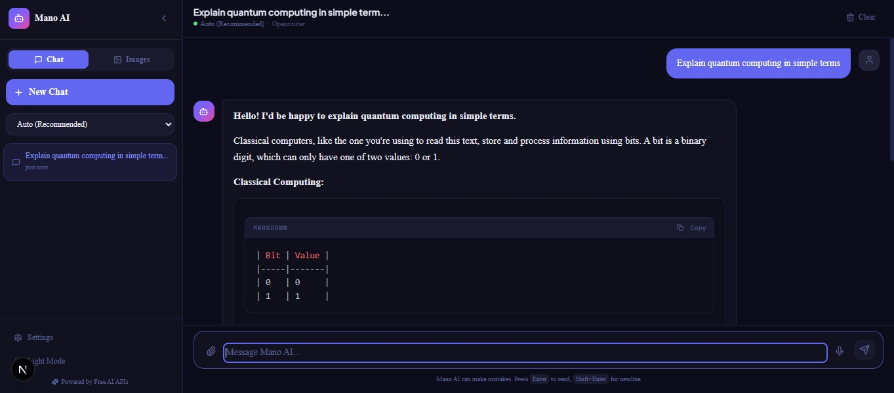
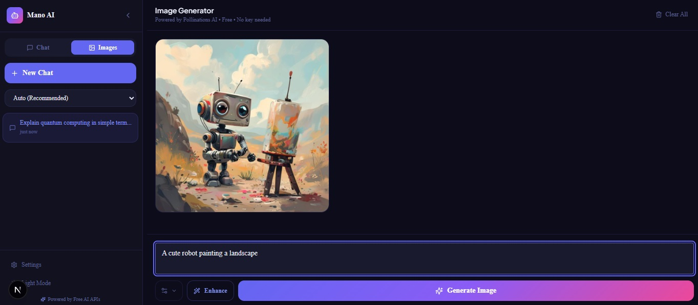

# 🤖 Mano AI Web

> A production-ready AI web application with streaming chat, image generation, voice input, and more — powered entirely by **free APIs**.



## ✨ Features

| Feature | Description | API Used |
|---------|-------------|----------|
| 💬 **AI Chatbot** | Streaming responses, markdown, code blocks | OpenRouter / Groq |
| 🖼️ **Image Generation** | Text → Image, multiple styles | Pollinations AI |
| 🎤 **Voice Input** | Speak your prompts | Web Speech API |
| 🔊 **Text-to-Speech** | AI reads responses aloud | Web Speech API |
| 📎 **File Upload** | Upload images/PDFs for analysis | Built-in |
| 🧠 **AI Memory** | Name, style preferences, system prompt | LocalStorage |
| 🌓 **Dark/Light Mode** | Beautiful in both themes | Built-in |
| 📥 **Export Chats** | Save as PDF or TXT | jsPDF |
| ✨ **Prompt Enhancer** | AI improves your image prompts | OpenRouter / Groq |
| 🔀 **Multi-Model** | Switch between 6+ free AI models | OpenRouter / Groq |

## 🚀 Quick Start

### 1. Clone and Install

```bash
git clone https://github.com/yourusername/mano-ai-web.git
cd mano-ai-web
npm install
```

### 2. Configure API Keys

```bash
cp .env.local.example .env.local
```

Edit `.env.local`:

```env
# Required for chat (get free keys):
OPENROUTER_API_KEY=sk-or-v1-xxxxx   # https://openrouter.ai (free)
GROQ_API_KEY=gsk_xxxxx              # https://console.groq.com (free)

# Optional for HuggingFace images:
HUGGINGFACE_API_KEY=hf_xxxxx        # https://huggingface.co/settings/tokens

# Pollinations AI needs NO key!
```

> **Note:** Even without any API keys, the app works using Pollinations AI as a free fallback for both chat and images.

### 3. Run Development Server

```bash
npm run dev
```

Open [http://localhost:3000](http://localhost:3000)

## 📁 Project Structure

```
mano-ai-web/
├── app/
│   ├── api/
│   │   ├── chat/route.ts          # Streaming chat endpoint
│   │   ├── image/route.ts         # Image generation endpoint
│   │   └── enhance-prompt/route.ts # Prompt enhancement
│   ├── app/page.tsx               # Main app interface
│   ├── page.tsx                   # Landing page
│   ├── layout.tsx                 # Root layout
│   └── globals.css                # Design system + CSS variables
├── components/
│   ├── layout/
│   │   └── Sidebar.tsx            # Sidebar with chat history
│   ├── chat/
│   │   ├── ChatPanel.tsx          # Full chat interface
│   │   ├── ChatMessage.tsx        # Message with markdown/code
│   │   └── ChatInput.tsx          # Input with voice/file upload
│   └── image/
│       └── ImagePanel.tsx         # Image generation UI
├── hooks/
│   ├── useChat.ts                 # Chat + streaming logic
│   ├── useVoice.ts                # Speech-to-Text + TTS
│   └── useImageGen.ts             # Image generation logic
├── store/
│   └── chatStore.ts               # Zustand global state
├── lib/
│   └── exportChat.ts              # PDF/TXT export
├── utils/
│   └── helpers.ts                 # Shared utilities
└── .env.local.example             # Environment template
```

## 🌐 Deploy to Vercel

### Option A — Vercel CLI

```bash
npm i -g vercel
vercel
```

### Option B — GitHub + Vercel Dashboard

1. Push to GitHub
2. Go to [vercel.com/new](https://vercel.com/new)
3. Import your repository
4. Add environment variables in **Settings → Environment Variables**:
   - `OPENROUTER_API_KEY`
   - `GROQ_API_KEY`
   - `HUGGINGFACE_API_KEY` (optional)
   - `NEXT_PUBLIC_APP_URL` (your production URL)
5. Click **Deploy**

## 🆓 Free API Setup Guide

### OpenRouter (Recommended for Chat)
1. Go to [openrouter.ai](https://openrouter.ai)
2. Sign up → Dashboard → API Keys → Create Key
3. Free models available: Mistral 7B, LLaMA 3 8B, Gemma 2 9B, Phi-3

### Groq (Fastest Free Inference)
1. Go to [console.groq.com](https://console.groq.com)
2. Sign up → API Keys → Create API Key
3. Free tier: 30 requests/minute

### Pollinations AI (Images — No Key!)
- Works out of the box, no signup needed
- URL: `https://image.pollinations.ai/prompt/{text}`

### HuggingFace (Optional Image Backup)
1. Go to [huggingface.co/settings/tokens](https://huggingface.co/settings/tokens)
2. Create a read token (free)

## 🛠️ Tech Stack

- **Framework**: Next.js 14 (App Router)
- **Language**: TypeScript
- **Styling**: Tailwind CSS
- **Animations**: Framer Motion
- **State**: Zustand (persisted to LocalStorage)
- **Markdown**: react-markdown + remark-gfm
- **Code Highlighting**: react-syntax-highlighter
- **PDF Export**: jsPDF
- **Deployment**: Vercel (free tier)

## 🔐 Security

- API keys are **server-side only** (Next.js API routes)
- Never exposed to the frontend
- All keys in `.env.local` (gitignored)

## 🖥️ App Screenshots
### Home Page
 


### Chat Interface


### Image


## 📄 License

MIT — Free to use, modify, and distribute.

---

<div align="center">
  <strong>⚡ Crafted by Tanzeel Ur Rehman</strong><br/>
  Built with Next.js · Tailwind CSS · Framer Motion
</div>


